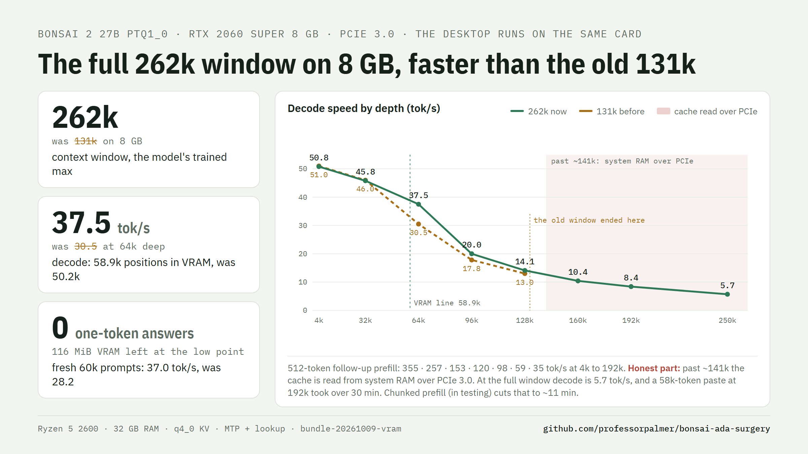

# Bonsai 2 27B: the full 262k window at q8_0 on a 12 GB card


The model's **full 262,144-token trained window with q8_0 KV cache on a 12 GB RTX 4070**, and the
speed and serving recipe that make that window usable. Patched [PrismML llama.cpp](https://github.com/PrismML-Eng/llama.cpp)
for Bonsai 2 27B (1.58-bit ternary `PTQ1_0`, 5.9 GB) with the MTP draft head. Same weights, nothing
re-quantized; every kernel checked against the CPU reference. The 12 GB card holds the first ~119k
positions (display on the CPU's iGPU); the rest of the cache (~5 GB) sits in pinned system RAM, so decode slows
past ~119k (table below) and the box needs ~8 GB of free RAM.

| RTX 4070 12 GB, served, one slot | decode, new text (tok/s) | decode, code (tok/s) | prefill (tok/s) |
| --- | ---: | ---: | ---: |
| 4k tokens of context | **102** | 102 | 1,173 |
| 16k | **83** | 242 | 1,137 |
| 32k | **78** | 175 | 1,031 |
| 64k | **69** | 109 | 867 |
| 112k (in VRAM) | **61** | 91 | 698 |
| 131k | **30** | 63 | 649 |
| 180k | **17.9** | 28 | 547 |
| 258k (the window's end) | **8.6** | 12.1 | 436 |

Measured 2026-10-08 with `bench/depth_table.sh` on the released bundle, a fresh prompt at each depth: 400-token
greedy answers (thinking off) with the default drafting (lookup + MTP head). New text = an essay; code = a
Python module, where the lookup drafter copies the answer's own repeated lines; prefill = cumulative for the
whole prompt. GDDR6X +1500 MHz (as in every number in this repo since #221), display on the CPU's iGPU. What those numbers replace:

| | before (this repo, Sep 2026) | now |
| --- | --- | --- |
| window on 12 GB with q8_0 KV | 96k (q4_0 for 262k) | **262,144** |
| decode at 32k / 64k | 47.6 / 36.9 | **78 / 69** on new text, **175 / 109** on code (2026-10-08 table) |
| decode when the answer copies the context (file rewrite), 4k / 130k / 250k | 117 / 63 / 18.5 (MTP only) | **352 / 164 / 66** (lookup drafting) |
| KV precision at 262k | q4_0: 1 flipped top token in 48 | q8_0: **1 in 160** |
| apps that send `effort: "high"` | HTTP 500 on every request | answered (normalized to medium) |
| apps with a 256-4096 token cap, thinking on | cut off mid-think | answered (cap raised to the think budget) |
| HumanEval 164 from apps that send `effort: "high"` | 0 (HTTP 500) | **160** |
| tool calls parsed (9 requests) | 1 of 9 (JSON asked for in content) | **9 of 9** (native XML, server grammar) |
| AppWorld, all 168 test tasks, ReAct code agent | 64.3% on the stock fork (published, 2.13-bpw file); 16 wrong-format replies, 15 step-cap exits | **70.8%** (95% CI 63.6-77.2); **1 and 1** |
| long exact-work suite, 37 tasks, same seeds | 17 raw | **28** behind the layer (13 rescues, 2 losses); 29 on a second seed set |
| AIME 2025 (60) / MMLU-Pro (100), raw -> layer | 52 / 71 | **56** / **76** |


How, and every receipt: [`docs/Q8_FULL_CONTEXT.md`](docs/Q8_FULL_CONTEXT.md). Short version:

- **Tiered KV cache** (`--kv-vram-cells`): the first ~119k positions of each layer's K/V live in VRAM, the rest
  in pinned system RAM mapped into the same CUDA address range. Kernels are unchanged and output is
  **bit-identical** to an all-VRAM cache. Past the line, attention copies the used RAM rows into VRAM with the
  copy engine first.
- **MTP drafting at every depth** (`--spec-draft-window`): the draft head only needs recent context, so its cache
  keeps the last 16k rows and stays small. With quantized-KV decode on the tensor-core attention kernel (one K/V
  read per verify batch), drafting now pays at every depth; the old 24k cutoff is gone.
- **Harness-proofing** (`--reasoning-effort-allow`, `--reasoning-max-tokens-floor`): the same weights score 0 to
  160 of 164 on HumanEval depending on what the client sends. The server absorbs both causes.
- **Lookup drafting** (patch 0039, on by default): an n-gram drafter drafts text that is already in the context, up
  to 32 tokens at a time, in front of the MTP head. When the answer copies the context (file rewrites, edit calls,
  quoted logs), decode is 3 to 3.6 times faster (file rewrite 117 -> 352 tok/s at 4k, 18.5 -> 66 at 250k). New text
  is unchanged, and so is the output.
- **Prefill past the VRAM line** (patch 0041): the K/V rows that a prefill batch writes past the line go to VRAM
  first and then to system RAM in whole blocks, and the next layer's RAM rows are copied while the layers before it
  compute. A 258k prompt: 369 -> 436 tok/s (time to first token 697 -> 589 s), same output.
- **Many tools cost no decode speed** (patch 0042): with speculative decoding the server copies the sampler on
  each draft step, and with tools the sampler holds the tool-call grammar. The grammar copy searched every grammar
  element for each stack entry, about 15 ms per step with 107 tool schemas. Now a binary search: an agent request
  with 107 tools at 63k, 41.8 -> 61.2 tok/s (2 tools: 63.5), same output ([issue #7](https://github.com/professorpalmer/bonsai-ada-surgery/issues/7)).
- What we took from [syv-ai/HyperQwen](https://github.com/syv-ai/HyperQwen), what we measured and what we decided:
  [`docs/HYPERQWEN.md`](docs/HYPERQWEN.md).

## Four ways in

| You have | Do this | Section |
| --- | --- | --- |
| Windows, an NVIDIA card (RTX 20/30/40/50) | download the release zip, drop in the model, run `start-server.ps1` | [Quick start (Windows)](#quick-start-windows-nvidia) |
| Hugging Face | the same bundle plus the ready-made MTP-grafted GGUF (`hf download`, no graft step) | [CaryPalmer/Ternary-Bonsai-2-27B-262k-GGUF](https://huggingface.co/CaryPalmer/Ternary-Bonsai-2-27B-262k-GGUF) |
| Linux, NVIDIA driver + CUDA toolkit | `bash build/build_linux.sh` builds the pinned PrismML source with all 49 patches applied | [Quick start (Linux)](#quick-start-linux-nvidia) |
| your own llama.cpp workflow | build the fork branch `bonsai-q8-product`, or `git am` the series in `patches/` onto PrismML `adfffbe` | [The patch stack](#the-patch-stack) |
| an older bundle of this repo | `git pull`, unzip the latest zip over it, run `layeretch_runtime.ps1` once | [Upgrading](#upgrading-from-an-older-bundle) |

The serving flags behind every number are listed under [Quick start (Linux)](#quick-start-linux-nvidia) as one
`llama-server` command line, so any build of the patched engine can reproduce the recipe.

## Quick start (Windows, NVIDIA)

1. Download `bonsai-bundle-win-x64.zip` from [Releases](../../releases) and unzip into this repo (it fills
   `bin\`), or build it (below). Binaries carry sm_75 / 86 / 89 machine code (RTX 20 / 30 / 40) plus compute_89
   PTX that RTX 50 cards compile at first load; they need only the NVIDIA driver.
2. Put `Ternary-Bonsai-2-27B-PTQ1_0.gguf` from [prism-ml on Hugging Face](https://huggingface.co/prism-ml) in
   `models\`.
3. Recommended: the MTP draft-head file (speculative decoding, +50-100% decode; every token is the target model's
   greedy choice, at rounding level not bit-identical to decoding without it, see docs/Q8_FULL_CONTEXT.md). Ready-made on
   Hugging Face (`hf download CaryPalmer/Ternary-Bonsai-2-27B-262k-GGUF Ternary-Bonsai-2-27B-PTQ1_0-mtp-procreations.gguf --local-dir models`;
   all 851 original tensors byte-identical to PrismML's file, `bench\gguf_tensor_identity.py`), or build it yourself:

   ```powershell
   git clone -b bonsai-q8-product https://github.com/professorpalmer/llama.cpp-ada-ternary vendor\prism-llama
   .\build\make_mtp_procreations.ps1   # ProCreations on-policy Q8 head grafted onto PTQ1_0
   ```

   It sparse-fetches the `blk.64` tensors from
   [ProCreations/Ternary-Bonsai-2-27B-MTP](https://huggingface.co/ProCreations/Ternary-Bonsai-2-27B-MTP), grafts
   them with [sudoingX's tools](https://github.com/sudoingX/bonsai2-small-gpu) and proves the trunk bytes by
   hashing against the original. `make_mtp_lean.ps1` is the older teacher-head graft (-4.3 pp acceptance).
4. Serve:

   ```powershell
   .\start-server.ps1
   ```

   OpenAI-compatible API on `http://<host>:8080/v1`, bearer key in `artifacts\api_key.txt` (created on first
   run), LAN exposed. `start-remote.ps1` adds a Cloudflare tunnel.

`start-server.ps1` sizes everything at launch: it reads free VRAM, keeps a safety margin below the point where
Windows demotes a background process's memory, and puts as many positions in VRAM as fit. Binaries from before
the tiered-KV runtime are detected and get the previous 96k all-VRAM recipe.

### Upgrading from an older bundle

`bundle-20261009-probe` fixes a **launcher stop on Windows PowerShell 5.1** (issue #14, from picmax): with Python on
PATH but without the `wasmtime` package, the probe for the optional layer stopped the launcher before the server
started. The probe now runs only when the layer's runtime is present and cannot stop the launcher. Engine and
measurements unchanged from `bundle-20261009-vram`.
`bundle-20261009-vram` puts **more of a long context in VRAM** (patches 0047-0049, from the 8 GB work). The packed
1-bit attention mask (0048-0049) is 1/16 of the f16 mask, 16 MiB instead of 256 MiB at 262k. On the 12 GB recipe the
saved 240 MiB move the VRAM line from 120,064 to 128,000 positions: decode 40.9 -> 48.2 tok/s at 131k and
21.2 -> 23.0 at 180k on the RTX 4070, prefill the same, text identical with drafting at 32k and 64k. On 8 GB cards
the preset now uses the full **262,144-token window** (with 24 GB of system RAM or more): partial staging (0047)
stops the staging buffer from growing with the window, and decode is faster than the old 131k preset at every depth
(RTX 2060 SUPER: 30.5 -> 37.8 tok/s at 64k). `LLAMA_ARG_KQ_MASK_PACKED=0` turns the packed mask off.


`bundle-20261009-agent` turns on **checkpoints inside long messages** for the 12 GB recipe too (patch 0046; the 8 GB
preset had it already). When an agent edits a tool result or sends a file again, the server restores the nearest
checkpoint instead of reading the whole prompt again: RTX 4070, 64.5 -> 15.5 s per request at 64k and 230 -> 49 s at
160k, text identical. It costs no VRAM and does not raise the server's limit of 32 checkpoints per slot (which a long
session already fills); long prompts that need no restore take about 1 s longer. `BONSAI_CKPT_EVERY=0` turns it off.
`bundle-20261009-pool` turns on the **shared CUDA pool** for the 12 GB recipe (one memory pool for the main and the
MTP draft context, and a 256-token draft micro-batch). It saves 74 MiB of VRAM, so the VRAM line moves up about 1.3k
positions: decode 39.3 -> 41.0 tok/s at 131k and 20.7 -> 21.2 at 180k on the RTX 4070, the same below the line; fresh
20k-60k prompts gave normal answers. It is on only with an engine that has patch 0045 (the stream order that makes
the pool safe with drafting); `BONSAI_SHARED_POOL=0` turns it off. Engine unchanged from `bundle-20261009-ckpt`.
`bundle-20261009-ckpt` adds patch 0046: **context checkpoints inside long messages**. This model keeps its
recurrent state only at user-message starts and at the prompt end, so a prompt that changes inside one long message
(an edited tool result, a file sent again) was processed again from the start. With `--checkpoint-every-nt` the
server also keeps a checkpoint every N tokens. The 8 GB preset sets 8192 (RTX 2060 SUPER at 64k: 227 -> 60.5 s per
request; `BONSAI_CKPT_EVERY=0` turns it off). On the 12 GB recipe it is on since `bundle-20261009-agent`;
measured there: 64.5 -> 15.5 s at 64k, 230 -> 49 s at 160k, text
identical. The launcher also shows the free VRAM at start and gives a warning when other programs hold much of it
(a start with 2.3 GB held put the VRAM line at 105k instead of 243k).
`bundle-20261008-8gbfix` fixes **1-token answers on 8 GB cards**. Since `bundle-20261007-8gb` the 8 GB preset turned
on a shared CUDA memory pool for the main and the MTP draft context. The two contexts run on two CUDA streams, and a
block freed by one could be reused by the other too early: on an RTX 2060 SUPER, a fresh prompt longer than about
30k sometimes got a 1-token answer (60k: 3 of 3 before, 0 of 3 now). The preset no longer turns the pool on; patch
0044 makes `GGML_CUDA_SHARED_POOL=0` turn it off, and patch 0045 orders the two streams so the pool is safe when it
is on (0 of 18 against 18 of 18). Patch 0043: the f16 prefill switch converts the cache only for batches of at least
64 queries, so lookup verify batches keep the in-place read (RTX 4070, switch on: 195.4 -> 212.4 tok/s on
copy-heavy decode; RTX 2060 SUPER: no change). The 8 GB preset now also turns on lookup drafting (RTX 2060 SUPER: file rewrites 58.2 -> 125.9 tok/s; `BONSAI_LOOKUP=0` turns it off). 12 GB cards with the default recipe: nothing changes. Unzip the new
bundle after `git pull`: an older zip has the old launcher.
`bundle-20261008-tools` makes **agent requests with many tools** faster (patch 0042). With speculative decoding the
server copies the sampler on each draft step, so that it can go back when a draft is rejected. With tools, the
sampler holds the tool-call grammar, and the grammar copy found each stack entry with a search over every element of
every grammar rule: about 15 ms per draft step with 107 tool schemas (an agent client with many MCP servers). Now
a binary search over the rule start addresses. 107 tools at 63k: 41.8 -> 61.2 tok/s on a plan-like answer,
47.6 -> 69.9 greedy, a request with three tool calls 60.1 -> 87.7; 2 tools give 63.5. Same output: same token counts,
same acceptance, same tool-call hash (`receipts/issue7_fix_ab.log`). Requests without tools do not change.
`bundle-20261008-tier` makes **prefill past the VRAM line** faster (patch 0041). Each prefill micro-batch wrote its new
K/V rows to system RAM in small pieces over PCIe once the prompt passed the line (~0.68 ms per prompt token). Now
the rows go to VRAM first and then to system RAM as whole 16-byte stores, and the next layer's system-RAM rows
are copied while the layers before it compute. One 258k prompt: 369 -> 436 tok/s; 180k: 484 -> 547; below the line, decode and output
unchanged. The speed table above is measured again with this bundle (the September numbers were older engines).
`bundle-20261008-lookup` turns on **lookup drafting** (patch 0039): a lookup drafter drafts text that is already in the
context, up to 32 tokens at a time, and the MTP head drafts new text. When the answer copies the context (file
rewrites, edit calls, quoted logs), decode is much faster; on new text it is unchanged, and the output is the same:
file rewrites 117 -> 352 tok/s at 4k and 63 -> 164 at 130k, edit calls +19% / +25%, plain text 90 -> 90.5
(`receipts/lookup_ab.jsonl`). The layer also sends an SSE keep-alive comment every 15 s while the server is silent,
so a long prefill does not drop through a proxy or a tunnel. `bundle-20261007-8gb` added patches 0036-0038 for 8 GB cards (the Turing one-column decode, the shared CUDA pool,
f16 prefill from pool memory; all off on 12 GB cards unless set) and the 8 GB launcher preset (`docs/8GB.md`).
Greedy output on the 12 GB recipe is identical to the previous bundle. `bundle-20261007-budget` added patch 0035: the server reports a forced close of the thinking (see *Reasoning budget
report* below), and a request that sends its own larger thinking budget gets an output cap to match. Greedy output
is identical to the previous binaries. `bundle-20261007-fixes` rebuilt the engine binaries for the first time since
`bundle-20260927`: the same 33 patches plus patch 0034, which stops JSON schemas with an empty `anyOf` / `oneOf` /
`type` from failing the request (issue #3; agent frameworks such as Hermes send them). The same bundle carries two
layer fixes from issues #3 and #4 and the Linux build fix from #5 (details in the release notes).
What the bundles between those two added runs beside the engine:

- `bundle-20261003`: **the Bonsai layer**, a small Python proxy the launcher starts in front of llama-server on the
  same port. It gives the model exact API cards for the Python modules a coding request involves, checks its code
  for names that do not exist, and offers a sandboxed Python tool (CPython 3.12 on WASI, no host files, network or
  processes) with the user's text available as `input.txt`. Clients need no changes. Measured, paired, same seeds:
  the long-exact-work suite 17 -> 28 of 37 (13 rescues, 2 losses) and 17 -> 29 on a second seed set, AIME 2025
  52 -> 56 of 60, MMLU-Pro 71 -> 76 of 100, HumanEval and MATH-500 unchanged; details and raw results in
  [`research/quality-20260929/REPORT.md`](research/quality-20260929/REPORT.md).
- `bundle-20261004`: the layer's tool loop at 12 rounds (the one loss mechanism, measured 7 of 9 vs 4 of 9 on the
  cases that hit the old cap), and the full AppWorld run of this serve: 70.8% task goal completion on all 168
  `test_normal` tasks (95% CI 63.6-77.2) against the published 64.3% for the 2.13-bpw file on the stock fork, with
  the two serving-side failure classes of that analysis (wrong-format replies, step-cap exits) down to 1 each.

To upgrade: `git pull` this repo, unzip the latest `bonsai-bundle-win-x64.zip` over it (new binaries in `bundle-20261008-tier`; it carries
the launcher, layer, suite and docs at the tag), run `layer\fetch_runtime.ps1` once (downloads the sandbox runtime,
installs the `wasmtime` Python package, runs the 14 isolation canaries), then `start-server.ps1` as before. The
launcher prints `layer on` when the runtime is present and falls back to the plain server when it is not;
`BONSAI_LAYER=0` turns it off. The suite runs against any OpenAI-compatible endpoint:
`python suite\run_suite.py --base http://127.0.0.1:18080 --base-b http://127.0.0.1:8080 --out suite-out`.

### Knobs (environment variables)

A variable stays set in a PowerShell window until you remove it or close the window. At start, the launcher lists
every `BONSAI_*`, `LLAMA_ARG_*` and `GGML_*` variable that is set, and it says when MTP is off and why (issue #7).

| Variable | Default | |
| --- | --- | --- |
| `BONSAI_CTX` | 262144 | context window |
| `BONSAI_CTK` | q8_0 | K/V cache type (q4_0: 12x the flipped tokens, see Quality) |
| `BONSAI_TIER` | 1 | 0 = all-VRAM cache (then 96k window) |
| `BONSAI_KV_VRAM_CELLS` | auto | pin the VRAM line |
| `BONSAI_VRAM_MARGIN` | 1000 (display on iGPU) / 1300 | MiB kept free below the demotion point |
| `BONSAI_SPEC` / `BONSAI_SPEC_DEEP` | 2 / 4 | draft size, and past the VRAM line |
| `BONSAI_LOOKUP` / `BONSAI_LOOKUP_N` | on / 32 | lookup drafting from the context and its draft limit; `BONSAI_LOOKUP=0` turns it off |
| `BONSAI_DRAFT_WINDOW` | 16384 | rows the draft head keeps |
| `BONSAI_EFFORT` | medium | server default reasoning effort |
| `BONSAI_THINK` | 1 | 0 = thinking off for every request |
| `BONSAI_THINK_BUDGET` | 20480 | thinking tokens before a forced close (-1 unlimited) |
| `BONSAI_HARNESS_PROOF` | 1 | 0 = pass effort words and output caps through unchanged |
| `BONSAI_EFFORT_ALLOWED` | medium | effort words the template sees; others become medium |
| `BONSAI_PORT`, `BONSAI_MODEL` | 8080, auto | |
| `BONSAI_MMPROJ` / `BONSAI_MMPROJ_GPU` | none / 0 | vision projector (`Ternary-Bonsai-2-27B-mmproj-Q8_0.gguf` from prism-ml, in `models\`; `LLAMA_ARG_MMPROJ` is picked up too). Default: the image encoder runs on the CPU, no VRAM and no speed cost, ~0.3 s more per image. `BONSAI_MMPROJ_GPU=1`: on the card, and the VRAM line gives up its size (`receipts/vision_probe.log`). A projector the sizing does not know about can over-commit the card and collapse prefill (issue #4, found by @Milor123) |

### Getting more positions into VRAM

Every GB of VRAM the desktop does not use is ~30k more q8_0 positions at full speed. Run the display from the
CPU's integrated graphics (monitor on the motherboard output, iGPU enabled in the BIOS) and set GPU-accelerated
apps (browser, Discord, remote-desktop host) to the iGPU in Windows **Settings > System > Display > Graphics**.
Measured on this 4070: desktop VRAM 930 -> 285 MiB, the safe margin 1300 -> 1000 MiB, VRAM line 95k -> 113k
positions, decode at 112k from PCIe-bound to 70 tok/s. ([chart](docs/img/igpu.png)) (Estimated beforehand: ~1 GB and ~30k positions. Windows
keeps ~220-275 MiB of compositor surfaces on the discrete card regardless, so the real gain was ~17k.)

### Keep the card to yourself

An app that keeps working on the GPU slows the server even when it uses no VRAM: Windows time-slices the card
between them, and MTP drafting (many short kernels per token) loses the most. Found by
[@Milor123](https://github.com/professorpalmer/bonsai-ada-surgery/issues/4): with KDE Connect running on the RTX 4070,
drafting gave 56 tok/s at 16k instead of 83; set to the iGPU, 83. The launcher samples GPU activity before it starts
the server and prints a `warn` line with the apps on the card when the GPU is already busy. Close the app or set it
to the integrated GPU in **Settings > System > Display > Graphics**.

### Other cards

| Card | Recipe | Notes |
| --- | --- | --- |
| 12 GB | defaults | this README |
| 16 GB and up | defaults | the whole q8_0 window fits: the tier switches itself off |
| 8 GB (2060 Super, 3060 Ti, 4060) | defaults (the launcher detects the card), plus `build\make_mtp_q4head.ps1` | q4_0, 262k window with 24 GB of RAM or more (131k below that), Q4_0 head, ~59k positions in VRAM; 2060 SUPER with the desktop on it: decode 51 / 46 / 38 / 20 / 14 tok/s at 4k / 32k / 64k / 96k / 128k, 5.7 at 250k. [docs/8GB.md](docs/8GB.md) |

Past the VRAM line decode is bound by PCIe (4.0 x16 here, ~23 GB/s). PCIe 3.0 or x8 slots halve those rows.

## Quality: the recipe matters as much as the kernels


The complaint about Bonsai 2 is code and agentic work, and most of that gap is runtime, not compression.
Details and every measurement: [`docs/QUALITY.md`](docs/QUALITY.md).

- **KV precision.** q4_0 KV flips the top token on 1 in 48 positions at depth, q8_0 on 1 in 160 (KL 0.00218 vs
  0.00017 against f16 KV). Every published 12 GB recipe used q4_0 to fit the window; this one keeps q8_0 across
  all of it. ([chart](docs/img/kv.png))
- **Reasoning effort.** The GGUF template defaults to `xhigh` (an extra "think carefully" line: runaway thinking,
  empty answers). `low` behaves close to `xhigh`. `medium` is the model's natural thinking and beats both, and
  thinking off, at every output cap from 2k up (Killy's HumanEval grid: 160-161 of 164). Default: `medium` with a
  20k thinking budget and a force-close message so a trip still yields the answer.
- **Reasoning budget report** (patch 0035). Every response to a request that ran with a thinking budget says
  whether the budget closed the thinking: `timings.reasoning_budget_exhausted` (`true` / `false`),
  `timings.reasoning_n` (tokens inside the thinking, forced tokens included) and the OpenAI field
  `usage.completion_tokens_details.reasoning_tokens`, streaming and non-streaming. A client can count forced
  closes without searching `reasoning_content` for the budget message. A request may send its own
  `reasoning_budget_tokens`; when that is above the server's budget, the output cap becomes that budget + 4096
  (also for a request with no `max_tokens`, which before was cut at the server default inside its thinking).
  Check: `python bench\budget_report_probe.py --base http://127.0.0.1:18080 --key-file artifacts\api_key.txt`. On agent work the budget rarely
  acts: AppWorld (168 tasks, 2835 model calls) has no call above 3,021 completion tokens.
- **Harness-proofing.** Cline, Kilo and Open WebUI send `effort: "high"`, which the template rejects: HTTP 500,
  0 of 164. Apps with 256-4096 token caps end a thinking model mid-thought (17-137 of 164). The server maps
  unknown effort words to medium and raises small caps to the thinking budget. Replays of Killy's rows against
  this server: [Killy's plates, replayed](docs/Q8_FULL_CONTEXT.md#killys-plates-replayed): `effort: "high"` 0 -> **160** of 164 (the same server with harness-proofing off: HTTP 500, 0), a 4096-token cap 137 -> **157**, medium **161**.
- **Tool calls.** The native format is Qwen3-Coder XML with raw string parameters, grammar-constrained by the
  server: 9 of 9 parsed vs 1 of 9 for JSON-in-content. For file-writing agents, thinking off parsed 8 of 9 vs 6
  of 9 at medium (which spent 10-17k tokens thinking first): send `enable_thinking: false` per request.
- **Generated pages: run them.** Killy's voxel pagoda at medium, 6 samples: 3 correct on the first try, and all 6
  after `bench/pagoda_plate.py --repair` rendered each page headless and sent back what it saw (console errors,
  voxels floating, structure out of view). The first-try misses were one-token slips (a space inside a hex
  literal, an import map missing its `imports` key). Agents that run their output get this for free.
  ([pagoda details](docs/Q8_FULL_CONTEXT.md#the-voxel-pagoda))


### For agents and apps

- Send `tools` and let the server format and parse calls; do not prompt for JSON tool calls in content.
- Tool-heavy agents: `chat_template_kwargs: {"enable_thinking": false}` per request. Chat and coding answers:
  leave the server default (medium).
- Clients that cap `max_tokens` low are fine: with thinking on the server raises the cap (disable with
  `BONSAI_HARNESS_PROOF=0`).

## The Bonsai layer (optional, Windows launcher)

A small server-side layer that `start-server.ps1` puts in front of `llama-server` on the same port, so clients
change nothing. It does four things:

- **API cards.** For Python coding requests it appends the exact API of the modules involved (generated from a
  real Python 3.12 runtime) to the first user message, with one sentence asking the model to use the library.
- **API check.** It checks code the model wrote in earlier tool calls for names and keyword arguments that do not
  exist, and notes them on the tool result.
- **Sandboxed Python tool.** For requests that bring no tools of their own, streamed or not, the model gets a
  `run_python` tool that runs in CPython on WASI (no host files, network or processes). The user's message text is
  available to the program as `input.txt`, so the model does not retype data. In a stream, the tool rounds appear
  as short notes in the reasoning stream; the answer streams as usual. Requests with client tools are passed
  through untouched (the model otherwise retypes paginated tool data into code and loses tasks).
- **Key check.** Requests with a wrong API key are rejected before any work is done.

Enable it once with `layeretch_runtime.ps1` (downloads the checksummed WASI Python, installs `wasmtime`, runs the
isolation canaries). It needs Python 3 on PATH. Without the runtime the plain server starts as before;
`BONSAI_LAYER=0` turns the layer off. Per request: `"code_interpreter": true|false`, `"api_cards": false`,
`"api_lint": false`, `"input_file": false`.

Measured on one RTX 4070, small paired task sets, plans and gates frozen before results (details and limits in
[research/quality-20260929/REPORT.md](research/quality-20260929/REPORT.md)):

| | raw server | with the layer |
| --- | ---: | ---: |
| product benchmark, gain tasks, fresh seeds (P2) | 8/20 | **19/20**, 0 losses |
| product benchmark, regression tasks (P2) | 14/17 | 15/17, 0 losses; non-coding requests pass through byte-identical |
| tar+gzip coding task, automatic cards | ~1/30 | 10/14 |
| ZIP coding task, automatic cards (E11, P2) | 0/10 | 8/10 |
| MIME email coding task (E11) | 0/6 | 0/6 (no transfer) |
| data questions, tokens with `input.txt` (E12) | | -58%, same correctness |
| streaming vs non-streaming tool loop (E13) | 12/12 | 12/12 |
| AIME 2025, 30 problems x 2 seeds (A1, A1b) | 52/60 | 56/60 (6 rescues, 2 losses: pre-declared gate not met; 1.17x tokens) |
| HumanEval 164, medium thinking (HE1) | 159/164 | 160/164 (neutral) |
| MATH-500, 100 integer-answer problems (M5) | 99/100 | 100/100 (neutral at a ceiling; 0.83x tokens) |
| MMLU-Pro, 100 questions over 13 subjects (K1) | 71/100 | 76/100 (10 rescues, 5 losses: no harm; 0.80x tokens) |
| AppWorld, 20 tasks, ReAct code agent (AW1, AW1b) | 13/20 | 15/20 after the fix (pure passthrough; 4/20 before it: the layer must not offer its tool to a client that runs code itself) |
| AppWorld, all 168 tasks, ReAct code agent, this serve as shipped (AW2) | 119/168 = **70.8%** (95% CI 63.6-77.2); wrong-format failures 1, step-cap failures 1 | layer not involved (passthrough). Public figure for the larger PQ2_0 file on the stock fork: 64.3% with 16 + 15 such failures |
| AppWorld, all 168 tasks, Prism's stock PQ2_0 (2.13 bpw) on this serve (AW2b) | 114/168 = 67.9% (CI 60.5-74.5); 0 wrong-format, 0 step-cap | same trits as PTQ1_0, same score within noise; public figure for this file on the stock fork: 64.3% |


Cards are proven on two library families and not on a third. Token cost through the layer, P2: long computations
0.08x to 0.76x, coding 0.81x to 0.87x, weblog 1.11x, checklist 1.16x.

## The patch stack

Everything is submitted upstream to PrismML; this repo ships the combined stack now: 49 commits on
`prism@adfffbe`, as `git am`-able patches in [`patches/`](patches/), as the branch
[`bonsai-q8-product`](https://github.com/professorpalmer/llama.cpp-ada-ternary/tree/bonsai-q8-product), and as
Windows binaries on [Releases](../../releases). Merged upstream already: #214 (branch-free PTQ1_0 MMQ tile loader,
2x prefill), #216 (4-column GDN warp layout) and #221 (the kernel and MTP series, 2026-09-29); the MTP
Hadamard-embedding fix of sudoingX's #217 landed through #205. #285 was split at the maintainers' request into
[#319](https://github.com/PrismML-Eng/llama.cpp/pull/319) (tiered KV), [#320](https://github.com/PrismML-Eng/llama.cpp/pull/320)
(draft window and tail), [#321](https://github.com/PrismML-Eng/llama.cpp/pull/321) (reasoning flags),
[#322](https://github.com/PrismML-Eng/llama.cpp/pull/322) (batch-invariant attention split) and
[#323](https://github.com/PrismML-Eng/llama.cpp/pull/323) (op timing); also open: #295 (a MUL_MAT_ID store bound),
#296 (a GDN fusion test). Nothing here waits on a merge: the bundle is the stack as it stands.

| Patches | What | Upstream |
| --- | --- | --- |
| 0001-0005 | planar-transposed q8 activations, 2-8 column PTQ1_0 mat-vec, `GGML_CUDA_BATCH_INVARIANT`, bf16 small-row mat-vec | sudoingX #218 |
| 0006 | recurrent-state gather folded into the GatedDeltaNet kernel | #220 |
| 0007-0008 | SoA q8 activations with exact integer sums, small-K GEMV, hybrid single/multi-column dispatch | #215, #221 |
| 0009 | flash attention reads q4_0/q8_0 K/V in place (no F16 scratch copy) | #221 |
| 0010 | multi-column PTQ1_0 mat-vec: raw digits, exact activation sums, per-pair epilogue | #221 |
| 0011-0016 | MTP graph and catch-up fixes, Hadamard self-quantization, out-of-vocab guard, pool teardown order | #221 |
| 0017-0027 | `--spec-draft-depth-max`, sm_120 build fix, #221 review round (PDL wait, BATCH_INVARIANT epilogue, ...) | #221 |
| 0028 | tiered KV cache (`--kv-vram-cells`) with copy-engine staging of the host tail | [#285](https://github.com/PrismML-Eng/llama.cpp/pull/285) |
| 0029 | quantized-KV GQA decode on the in-place MMA attention kernel | #285 |
| 0030 | `BATCH_INVARIANT`: occupancy-independent attention split, PTQ1_0 mat-vec up to 8 columns | #285 |
| 0031 | `--spec-draft-window`, `--spec-draft-n-max-tail` | #285 |
| 0032 | `--reasoning-effort-allow/-fallback`, `--reasoning-max-tokens-floor` | #285 |
| 0033 | `GGML_CUDA_OP_TIMING` per-node GPU time (diagnostics) | #285 |
| 0034 | JSON schema to grammar: empty `anyOf` / `oneOf` / `type` unions are converted instead of failing the request (reported by Milor123, #3) | upstream ggml-org rejects them with a clear error since its September schema rewrite; PrismML PR |
| 0035 | reasoning budget report (`reasoning_budget_exhausted`, `reasoning_n`, `usage.completion_tokens_details.reasoning_tokens`); a per-request budget above the server's raises the output cap to budget + 4096 | this repo |
| 0036 | Turing takes the planar PTQ1_0 layout at one column as well as Ampere (8 GB cards, RTX 20) | [#325](https://github.com/PrismML-Eng/llama.cpp/pull/325) |
| 0037 | `GGML_CUDA_SHARED_POOL=1`: one transient CUDA pool for the target and the draft context; `LLAMA_MTP_DRAFT_UBATCH` (off by default; the 8 GB preset sets them) | this repo |
| 0038 | `GGML_CUDA_FA_PREFILL_F16=N`: prefill-sized attention converts a quantized cache of up to N cells to f16 in pool memory (off by default; the 8 GB preset sets it) | [#330](https://github.com/PrismML-Eng/llama.cpp/pull/330) |
| 0039 | `--spec-lookup-n-max N`: a separate draft limit for the lookup drafters (`ngram-*`) listed before the model drafter; the MTP head keeps `--spec-draft-n-max` | this repo |
| 0040 | ADD+RMS_NORM+MUL fusion on every NVIDIA GPU (it ran on GB10 only); the fusion range check accepts exact aliases (by @cklxx) | [#209](https://github.com/PrismML-Eng/llama.cpp/pull/209) |
| 0041 | Tiered KV prefill: rows that a prefill micro-batch writes past the VRAM line go to VRAM first and then to system RAM as whole 16-byte stores (the quantizing write cost ~0.68 ms per prefill token over PCIe); the host rows of the next attention layer are copied on a second stream while the layers before it compute | this repo |
| 0042 | Grammar copy: `llama_grammar_clone_impl` finds each stack entry by a binary search over the rule start addresses (it searched every element of every rule; the server copies the sampler on each speculative step, so a request with 107 tools lost ~15 ms per step) | this repo |
| 0043 | `GGML_CUDA_FA_PREFILL_F16` converts the cache only for batches of at least 64 queries (`GGML_CUDA_FA_PREFILL_F16_MIN_Q`): speculative verify batches keep the in-place quantized read (Ada: 195.4 -> 212.4 tok/s on copy-heavy decode with the switch on; Turing: no change) | [#330](https://github.com/PrismML-Eng/llama.cpp/pull/330) (offered) |
| 0044 | `GGML_CUDA_SHARED_POOL=0` turns the shared pool off (any value turned it on) | this repo |
| 0045 | Shared pool: each graph waits for the other stream's last graph, so the target and the MTP draft stream cannot reuse each other's freed blocks too early (RTX 2060 SUPER, fresh 60k: 0 of 18 1-token answers against 18 of 18) | this repo |
| 0046 | `--checkpoint-every-nt N` (`LLAMA_ARG_CHECKPOINT_EVERY_NT`): context checkpoints also inside a long message, every N prompt tokens, so a prompt that changes inside that message is not processed again from the start (off by default; the 8 GB preset sets 8192; RTX 2060 SUPER at 64k: 18-58 s instead of 272-294 s per request, same text) | this repo |
| 0047 | Tiered KV partial staging: `GGML_CUDA_KV_TIER_STAGING_FRAC=f` gives a VRAM staging buffer only to the first f of each host tail; host rows past it are read in place. The staging buffer no longer grows with the window (RTX 2060 SUPER, 262k: no VRAM over-commit, prefill the same as 131k up to the staged depth). `GGML_CUDA_KV_TIER_STAGE_MIN_Q=q`: ops with fewer than q queries read in place (both off by default) | this repo |
| 0048 | Packed (1-bit) KQ mask, step 1: `--kq-mask-packed` (`LLAMA_ARG_KQ_MASK_PACKED`), I32 mask with 32 cells per word for batches of 32+ queries; 1/16 of the f16 mask (n_ctx x ubatch x 2 B: 128 MiB at 131k, 256 MiB at 262k) | this repo (Mirai engine) |
| 0049 | Packed KQ mask, step 2: the tensor-core flash-attention kernel reads the bits natively. With MTP drafting at 32k and 64k: 22 of 22 texts identical to the f16 mask (RTX 2060 SUPER) | this repo (Mirai engine) |
| 0051 | Chunked flash attention for prefill at depth (`GGML_CUDA_FA_CHUNK=C`): prefill-sized ops past the f16 prefill limit split the KV dimension into chunks of C cells (copied to VRAM, converted to f16, f16 tensor-core kernel, folded with the softmax max and sum), so VRAM stays bounded and host rows cross PCIe once per op. RTX 2060 SUPER, 262k: prefill x1.4 at 128k, x2 at 192k, x3.6 at 250k; perplexity at 64k 7.2107 (whole f16) / 7.2074 (chunked) (off by default; the 8 GB preset sets 32768) | this repo |
| 0052 | Tests: flash-attention cases for the chunked path (q4_0 K/V, head 256, GQA, f16 and packed masks) | this repo |

How each cut was found (CUPTI traces, L1 wavefront counts, what did not work):
[`surgery/ADA4070_PTQ1.md`](surgery/ADA4070_PTQ1.md) and [`docs/Q8_FULL_CONTEXT.md`](docs/Q8_FULL_CONTEXT.md).

## Quick start (Linux, NVIDIA)

`build/build_linux.sh` fetches the pinned PrismML source (`adfffbe`) and applies **all 49 bundled patches**,
including the `common.cuh` header fix (0024) and the Hopper/Blackwell PDL dependency wait (0026). No manual patch
application or Git author configuration is needed. There is no prebuilt Linux binary yet.

Prerequisites: NVIDIA driver, CUDA toolkit (`nvcc` on PATH), Git, CMake >= 3.24, and a C++ compiler supported by
your CUDA toolkit. On Ubuntu/Debian, the ordinary build dependencies are:

```bash
sudo apt-get update
sudo apt-get install -y git cmake build-essential libcurl4-openssl-dev libssl-dev
```

Install the NVIDIA CUDA toolkit separately if `nvcc --version` is unavailable. CUDA 13.x is not the cause of the
undefined `ggml_cuda_info` error below.

```bash
git clone https://github.com/professorpalmer/bonsai-ada-surgery.git
cd bonsai-ada-surgery
bash build/build_linux.sh
bash start-linux.sh /absolute/path/to/Ternary-Bonsai-2-27B-PTQ1_0.gguf
```

Use the official original `Ternary-Bonsai-2-27B-PTQ1_0.gguf` from
[the official model download](https://huggingface.co/prism-ml/Ternary-Bonsai-2-27B-gguf/blob/main/Ternary-Bonsai-2-27B-PTQ1_0.gguf);
the model download is separate. If you already have it, pass its existing path. The scripts do not install system
packages, download weights, or change your existing `vendor/prism-llama` checkout.

Open **http://127.0.0.1:8080** on the same machine. The API is at `http://127.0.0.1:8080/v1`. Ctrl-C stops it.
`start-linux.sh` is a first-run configuration: 8k context, full GPU offload, flash attention, no speculative draft.
It is not the Windows recipe behind the headline numbers. The same runtime flags work on Linux; for the full window
with q8_0 KV on a 12 GB card, launch the built server directly, for example:

```bash
llama-server -m Ternary-Bonsai-2-27B-PTQ1_0-mtp-procreations.gguf -ngl 99 -fa on -c 262144 -np 1 \
  -ctk q8_0 -ctv q8_0 --kv-vram-cells 110000 \
  --spec-type draft-mtp --spec-draft-n-max 2 --spec-draft-n-max-tail 4 --spec-draft-window 16384 -ctkd q8_0 -ctvd q8_0 \
  --reasoning-effort-allow medium --reasoning-max-tokens-floor 24576 --reasoning-budget 20480 \
  --chat-template-kwargs '{"reasoning_effort":"medium"}' --jinja --host 127.0.0.1 --port 8080
```

(`--kv-vram-cells`: as many positions as fit in VRAM next to the weights, ~34.8 KB per q8_0 position for this model;
Linux has no WDDM demotion, so less margin is needed than on Windows. Untested on Linux here.)

Set `BONSAI_CTX` and `BONSAI_PORT` to change the `start-linux.sh` defaults. The build uses four jobs by default;
lower `BONSAI_BUILD_JOBS` on low-memory hosts. CMake detects the GPU by default. For a headless build without an
attached GPU, pass its target architecture, e.g. `BONSAI_CUDA_ARCH=89 bash build/build_linux.sh` for Ada.

The build uses a separate source directory keyed by the base commit and patch contents. Repeating the command reuses
its build; changed patches get a new source directory. It refuses to overwrite tracked edits in an existing
generated source tree. After pulling updates to this bundle, rerun the build script.

The [Linux CUDA build workflow](.github/workflows/linux-cuda.yml) compiles the patch stack with CUDA 13 for Ada
without a GPU. A successful compile does not establish GPU inference correctness or Linux benchmark results.

### Direct fork build (alternative)

The buildable llama.cpp fork is
[llama.cpp-ada-ternary, branch `bonsai-q8-product`](https://github.com/professorpalmer/llama.cpp-ada-ternary/tree/bonsai-q8-product)
(the same tree as the patch series). `bonsai-combo` is #221 alone, without the tiered KV cache and the newer flags.

```bash
git clone --branch bonsai-q8-product https://github.com/professorpalmer/llama.cpp-ada-ternary
cd llama.cpp-ada-ternary
cmake -S . -B build-linux -DGGML_CUDA=ON \
  -DCMAKE_BUILD_TYPE=Release -DCMAKE_CUDA_ARCHITECTURES=native
cmake --build build-linux --target llama-server -j4
```

### Updating an existing source checkout

Run these inside the **llama.cpp fork**, such as `vendor/prism-llama`, rather than in the outer
`bonsai-ada-surgery` directory:

```bash
git fetch origin
git switch bonsai-q8-product
git pull --ff-only
```

Then rerun the configure and build commands above. Preserve any local changes; if Git cannot fast-forward, use a
separate fresh clone instead of resetting it.

The `common.cuh` errors saying `ggml_cuda_info` and `ggml_cuda_get_device` are undefined come from a
declaration-order bug fixed in
[`32842f6`](https://github.com/professorpalmer/llama.cpp-ada-ternary/commit/32842f6cf208187d1624da5d968e410e117772d8).
Patch `0024` carries that fix for patch-series users. Downgrading CUDA does not address this source-order error.
Updating only the outer bundle does not update an already cloned `vendor/prism-llama` checkout.

## Build from source

Windows without the CUDA toolkit (VS 2022 Build Tools C++ workload + NVIDIA's pip wheels):

```powershell
python -m pip install cmake ninja nvidia-cuda-nvcc nvidia-cuda-runtime nvidia-cublas nvidia-cuda-nvrtc
git clone -b bonsai-q8-product https://github.com/professorpalmer/llama.cpp-ada-ternary vendor\prism-llama
.\build\build_windows.ps1                    # arch from nvidia-smi; -Arch "75;86;89;89-virtual" for a release build
```

### Alternative: apply the bundled patches to PrismML source

Use a fresh checkout at the exact base below. Do not apply this series on top of `bonsai-q8-product` or
`bonsai-combo`, which already include the changes. From this bundle's root:

```bash
BONSAI_PATCH_DIR="$PWD/patches"
git clone https://github.com/PrismML-Eng/llama.cpp vendor/prism-patched
cd vendor/prism-patched
git checkout adfffbe
git am "$BONSAI_PATCH_DIR"/*.patch
cmake -S . -B build-linux -DGGML_CUDA=ON \
  -DCMAKE_BUILD_TYPE=Release -DCMAKE_CUDA_ARCHITECTURES=native
cmake --build build-linux --target llama-server -j4
```

`git am` requires your Git author name and email to be configured. The series is verified to reproduce the
`bonsai-q8-product` tree exactly on a fresh `adfffbe` checkout.

## Measure it yourself

**Benchmark your own model the same way:** [`docs/BENCHMARK.md`](docs/BENCHMARK.md) has the server line, chat
template, runners and settings behind the quality numbers above, for any model on any OpenAI-compatible server
(for example the base model at Q4 on your own GPU), and what to send back so we can pair it with ours.

```powershell
bench\killy_suite.ps1                          # HumanEval replays of Killy's plates + the voxel pagoda (~5 h)
python bench\receipt.py <tag>                  # decode by depth, prefill, TTFT, power, VRAM by window
python bench\quick_tps.py --key-file artifacts\api_key.txt --depth 32000   # served decode at depth
bench\kv_kl_sweep.ps1                          # KV precision KL table (needs wikitext-2)
bench\kv_mean_center_kl.ps1                    # K mean-centering on top of the Hadamard KV rotation (no gain)
python bench\toolcall_stress.py                # tool-call syntax, XML+grammar vs JSON-in-content
python bench\humaneval_run.py --arm medium     # HumanEval 164, tests executed
python bench\mtp_identity.py                   # greedy draft-on vs draft-off
```

## Layout

| Path | What |
| --- | --- |
| `patches/` | the 33-commit stack on PrismML `adfffbe`, `git am`-able |
| `start-server.ps1`, `start-remote.ps1` | the recipe (LAN / Cloudflare tunnel) |
| `build/build_linux.sh`, `start-linux.sh` | Linux build from the pinned base + patches, first-run launcher |
| `tests/`, `.github/workflows/` | Linux setup tests, Linux CUDA compile and PDL code-generation CI |
| `build/` | toolkit-free Windows CUDA build, MTP head grafts |
| `docs/Q8_FULL_CONTEXT.md` | q8_0 at 262k on 12 GB: mechanisms, receipts, identity matrix, rejected ideas |
| `docs/QUALITY.md` | KV precision, reasoning effort, tool-call syntax, harness-proofing |
| `docs/RECEIPTS.md` | speed receipts, this card and others |
| `bench/` | receipts, KL sweeps, tool-call stress, HumanEval runner and Killy replays |
| `surgery/` | the kernel investigation: write-up, CUPTI injection profiler, clock sweeps, dead ends |

## Credits

PrismML for the model and the fork. sudoingX for the planar-transposed layout, the batch-invariant mode, the
Hadamard-inverse fix and the MTP graft tools. ProCreations for the on-policy MTP head (Apache 2.0; independent
of PrismML). Killy (@net_termina) for the failure census and the HumanEval plates that turned "quality is worse"
into fixable buckets. MIT for everything here; weights are PrismML's (Apache 2.0). Not affiliated with PrismML.

### Hopper/Blackwell PDL fix

Patch `0026` carries `09b6cce`. The planar PTQ1_0 mat-vec calls `ggml_cuda_pdl_sync()` before reading activations
produced by the q8_1 quantization kernel. Without that wait, programmatic dependent launch can let the consumer
read unfinished output on Hopper/Blackwell. LamplighterPaul reported corrupt `llama-server` output on an RTX 5080,
including the `GGML_CUDA_PDL=0` isolation, in
[Prism #218](https://github.com/PrismML-Eng/llama.cpp/pull/218#issuecomment-5833071266). This is a synchronization
bug, separate from KV-cache quantization quality. The helper is a no-op on Ampere/Ada. Windows Release bundles from
2026-09-27 on contain it; older downloaded binaries are not updated by pulling patches. The reporter's hardware
result is not a new hardware test of this bundle.

The [PDL code-generation check](https://github.com/professorpalmer/bonsai-ada-surgery/actions/workflows/pdl-codegen.yml)
compiles the actual planar kernel for sm_89, sm_90, and sm_120a. It checks all 24 column/fusion template variants.
On Hopper/Blackwell, removing the fix must fail the ordering check; with the fix, one unconditional
`griddepcontrol.wait` must precede global-memory loads. Ada must emit no wait in either case. This is a compiler
regression check, not a GPU runtime or performance benchmark. To reproduce with CUDA 13 and an already-patched
source checkout:

```bash
python3 tests/check_pdl_codegen.py /path/to/patched/llama.cpp --arch 120a
```
