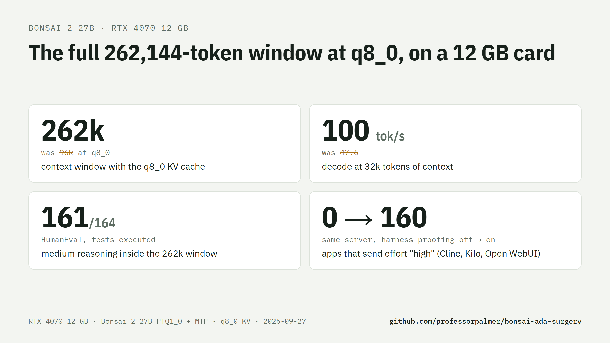
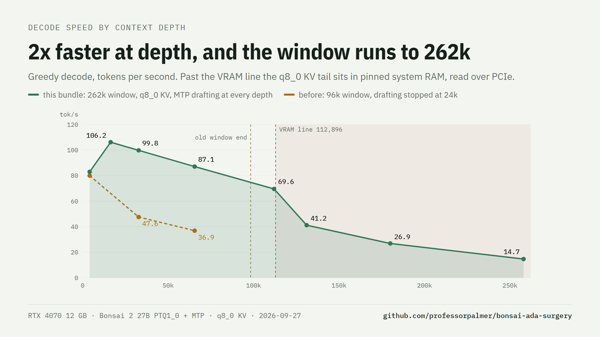
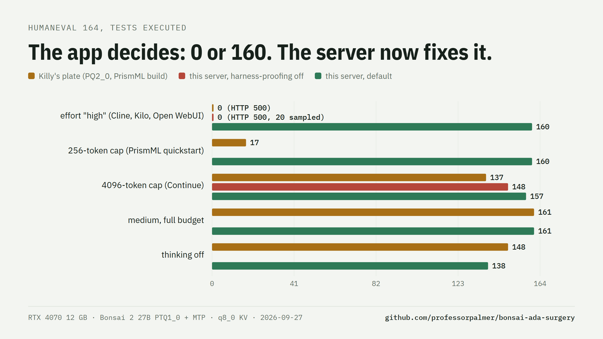
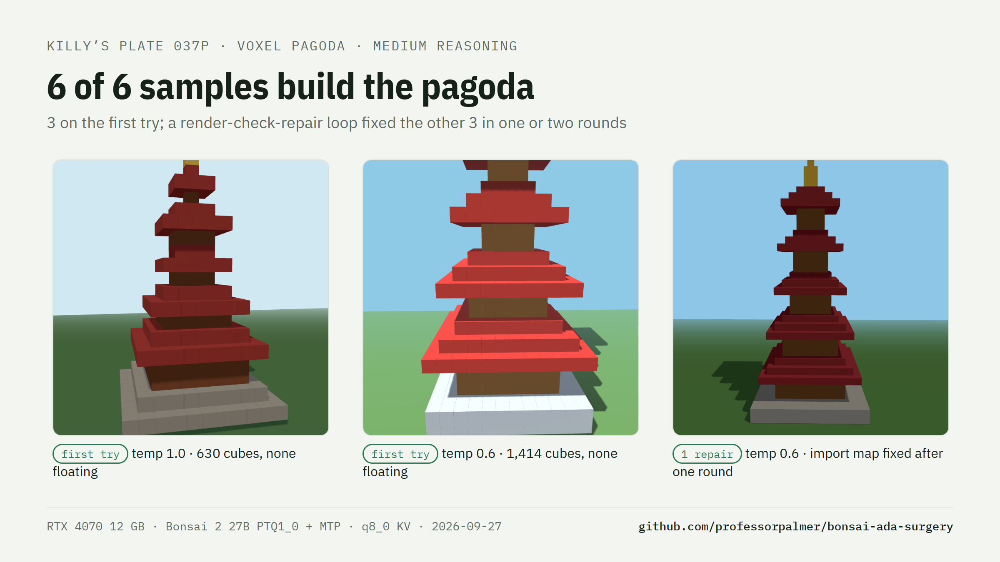
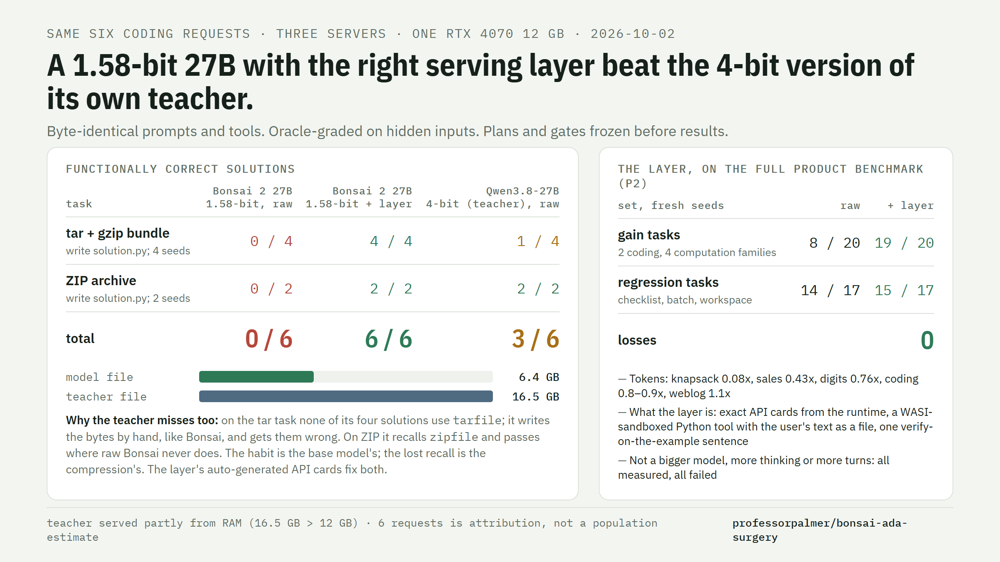

# Bonsai 2 27B: the full 262k window at q8_0 on a 12 GB card



The model's **full 262,144-token trained window with q8_0 KV cache on a 12 GB RTX 4070**, and the
speed and serving recipe that make that window usable. Patched [PrismML llama.cpp](https://github.com/PrismML-Eng/llama.cpp)
for Bonsai 2 27B (1.58-bit ternary `PTQ1_0`, 5.9 GB) with the MTP draft head. Same weights, nothing
re-quantized; every kernel checked against the CPU reference. The 12 GB card holds the first ~113k
positions; the rest of the cache (~5.2 GB) sits in pinned system RAM, so decode slows past 112k
(table below) and the box needs ~8 GB of free RAM.

| RTX 4070 12 GB, served, one slot | decode (tok/s) | prefill (tok/s) |
| --- | ---: | ---: |
| 4k tokens of context | **83** | 1,100 |
| 16k | **106** | 1,100 |
| 32k | **100** | 918 |
| 64k | **87** | 724 |
| 112k (last position in VRAM) | **70** | 539 |
| 131k | **41** | 374 |
| 180k | 27 | 298 |
| 258k (the window's end) | 14.7 | 229 |

Greedy code continuation, 256 tokens, MTP draft head on, cumulative prefill; GDDR6X +1500 MHz (as in every
number in this repo since #221), display on the CPU's iGPU. What those numbers replace:

| | before (this repo, Sep 2026) | now |
| --- | --- | --- |
| window on 12 GB with q8_0 KV | 96k (q4_0 for 262k) | **262,144** |
| decode at 32k / 64k | 47.6 / 36.9 | **100 / 87** |
| KV precision at 262k | q4_0: 1 flipped top token in 48 | q8_0: **1 in 160** |
| apps that send `effort: "high"` | HTTP 500 on every request | answered (normalized to medium) |
| apps with a 256-4096 token cap, thinking on | cut off mid-think | answered (cap raised to the think budget) |



How, and every receipt: [`docs/Q8_FULL_CONTEXT.md`](docs/Q8_FULL_CONTEXT.md). Short version:

- **Tiered KV cache** (`--kv-vram-cells`): the first ~113k positions of each layer's K/V live in VRAM, the rest
  in pinned system RAM mapped into the same CUDA address range. Kernels are unchanged and output is
  **bit-identical** to an all-VRAM cache. Past the line, attention copies the used RAM rows into VRAM with the
  copy engine first.
- **MTP drafting at every depth** (`--spec-draft-window`): the draft head only needs recent context, so its cache
  keeps the last 16k rows and stays small. With quantized-KV decode on the tensor-core attention kernel (one K/V
  read per verify batch), drafting now pays at every depth; the old 24k cutoff is gone.
- **Harness-proofing** (`--reasoning-effort-allow`, `--reasoning-max-tokens-floor`): the same weights score 0 to
  160 of 164 on HumanEval depending on what the client sends. The server absorbs both causes.

## Quick start (Windows, NVIDIA)

1. Download `bonsai-bundle-win-x64.zip` from [Releases](../../releases) and unzip into this repo (it fills
   `bin\`), or build it (below). Binaries carry sm_75 / 86 / 89 machine code (RTX 20 / 30 / 40) plus compute_89
   PTX that RTX 50 cards compile at first load; they need only the NVIDIA driver.
2. Put `Ternary-Bonsai-2-27B-PTQ1_0.gguf` from [prism-ml on Hugging Face](https://huggingface.co/prism-ml) in
   `models\`.
3. Recommended: build the MTP draft-head file (lossless speculative decoding, +50-100% decode).

   ```powershell
   git clone -b bonsai-q8-product https://github.com/professorpalmer/llama.cpp-ada-ternary vendor\prism-llama
   .\build\make_mtp_procreations.ps1   # ProCreations on-policy Q8 head grafted onto PTQ1_0
   ```

   It sparse-fetches the `blk.64` tensors from
   [ProCreations/Ternary-Bonsai-2-27B-MTP](https://huggingface.co/ProCreations/Ternary-Bonsai-2-27B-MTP), grafts
   them with [sudoingX's tools](https://github.com/sudoingX/bonsai2-small-gpu) and proves the trunk bytes by
   hashing against the original. `make_mtp_lean.ps1` is the older teacher-head graft (-4.3 pp acceptance).
4. Serve:

   ```powershell
   .\start-server.ps1
   ```

   OpenAI-compatible API on `http://<host>:8080/v1`, bearer key in `artifacts\api_key.txt` (created on first
   run), LAN exposed. `start-remote.ps1` adds a Cloudflare tunnel.

`start-server.ps1` sizes everything at launch: it reads free VRAM, keeps a safety margin below the point where
Windows demotes a background process's memory, and puts as many positions in VRAM as fit. Binaries from before
the tiered-KV runtime are detected and get the previous 96k all-VRAM recipe.

### Knobs (environment variables)

| Variable | Default | |
| --- | --- | --- |
| `BONSAI_CTX` | 262144 | context window |
| `BONSAI_CTK` | q8_0 | K/V cache type (q4_0: 12x the flipped tokens, see Quality) |
| `BONSAI_TIER` | 1 | 0 = all-VRAM cache (then 96k window) |
| `BONSAI_KV_VRAM_CELLS` | auto | pin the VRAM line |
| `BONSAI_VRAM_MARGIN` | 1000 (display on iGPU) / 1300 | MiB kept free below the demotion point |
| `BONSAI_SPEC` / `BONSAI_SPEC_DEEP` | 2 / 4 | draft size, and past the VRAM line |
| `BONSAI_DRAFT_WINDOW` | 16384 | rows the draft head keeps |
| `BONSAI_EFFORT` | medium | server default reasoning effort |
| `BONSAI_THINK` | 1 | 0 = thinking off for every request |
| `BONSAI_THINK_BUDGET` | 20480 | thinking tokens before a forced close (-1 unlimited) |
| `BONSAI_HARNESS_PROOF` | 1 | 0 = pass effort words and output caps through unchanged |
| `BONSAI_EFFORT_ALLOWED` | medium | effort words the template sees; others become medium |
| `BONSAI_PORT`, `BONSAI_MODEL` | 8080, auto | |

### Getting more positions into VRAM

Every GB of VRAM the desktop does not use is ~30k more q8_0 positions at full speed. Run the display from the
CPU's integrated graphics (monitor on the motherboard output, iGPU enabled in the BIOS) and set GPU-accelerated
apps (browser, Discord, remote-desktop host) to the iGPU in Windows **Settings > System > Display > Graphics**.
Measured on this 4070: desktop VRAM 930 -> 285 MiB, the safe margin 1300 -> 1000 MiB, VRAM line 95k -> 113k
positions, decode at 112k from PCIe-bound to 70 tok/s. ([chart](docs/img/igpu.png)) (Estimated beforehand: ~1 GB and ~30k positions. Windows
keeps ~220-275 MiB of compositor surfaces on the discrete card regardless, so the real gain was ~17k.)

### Other cards

| Card | Recipe | Notes |
| --- | --- | --- |
| 12 GB | defaults | this README |
| 16 GB and up | defaults | the whole q8_0 window fits: the tier switches itself off |
| 8 GB (2060 Super, 3060 Ti, 4060) | defaults, or `BONSAI_CTX=65536` | tiered KV keeps q8_0; expect speed in the ratio of your bandwidth to 504 GB/s. Untested here |

Past the VRAM line decode is bound by PCIe (4.0 x16 here, ~23 GB/s). PCIe 3.0 or x8 slots halve those rows.

## Quality: the recipe matters as much as the kernels



The complaint about Bonsai 2 is code and agentic work, and most of that gap is runtime, not compression.
Details and every measurement: [`docs/QUALITY.md`](docs/QUALITY.md).

- **KV precision.** q4_0 KV flips the top token on 1 in 48 positions at depth, q8_0 on 1 in 160 (KL 0.00218 vs
  0.00017 against f16 KV). Every published 12 GB recipe used q4_0 to fit the window; this one keeps q8_0 across
  all of it. ([chart](docs/img/kv.png))
- **Reasoning effort.** The GGUF template defaults to `xhigh` (an extra "think carefully" line: runaway thinking,
  empty answers). `low` behaves close to `xhigh`. `medium` is the model's natural thinking and beats both, and
  thinking off, at every output cap from 2k up (Killy's HumanEval grid: 160-161 of 164). Default: `medium` with a
  20k thinking budget and a force-close message so a trip still yields the answer.
- **Harness-proofing.** Cline, Kilo and Open WebUI send `effort: "high"`, which the template rejects: HTTP 500,
  0 of 164. Apps with 256-4096 token caps end a thinking model mid-thought (17-137 of 164). The server maps
  unknown effort words to medium and raises small caps to the thinking budget. Replays of Killy's rows against
  this server: [Killy's plates, replayed](docs/Q8_FULL_CONTEXT.md#killys-plates-replayed): `effort: "high"` 0 -> **160** of 164 (the same server with harness-proofing off: HTTP 500, 0), a 4096-token cap 137 -> **157**, medium **161**.
- **Tool calls.** The native format is Qwen3-Coder XML with raw string parameters, grammar-constrained by the
  server: 9 of 9 parsed vs 1 of 9 for JSON-in-content. For file-writing agents, thinking off parsed 8 of 9 vs 6
  of 9 at medium (which spent 10-17k tokens thinking first): send `enable_thinking: false` per request.
- **Generated pages: run them.** Killy's voxel pagoda at medium, 6 samples: 3 correct on the first try, and all 6
  after `bench/pagoda_plate.py --repair` rendered each page headless and sent back what it saw (console errors,
  voxels floating, structure out of view). The first-try misses were one-token slips (a space inside a hex
  literal, an import map missing its `imports` key). Agents that run their output get this for free.
  ([pagoda details](docs/Q8_FULL_CONTEXT.md#the-voxel-pagoda))



### For agents and apps

- Send `tools` and let the server format and parse calls; do not prompt for JSON tool calls in content.
- Tool-heavy agents: `chat_template_kwargs: {"enable_thinking": false}` per request. Chat and coding answers:
  leave the server default (medium).
- Clients that cap `max_tokens` low are fine: with thinking on the server raises the cap (disable with
  `BONSAI_HARNESS_PROOF=0`).

## The Bonsai layer (optional, Windows launcher)

A small server-side layer that `start-server.ps1` puts in front of `llama-server` on the same port, so clients
change nothing. It does four things:

- **API cards.** For Python coding requests it appends the exact API of the modules involved (generated from a
  real Python 3.12 runtime) to the first user message, with one sentence asking the model to use the library.
- **API check.** It checks code the model wrote in earlier tool calls for names and keyword arguments that do not
  exist, and notes them on the tool result.
- **Sandboxed Python tool.** For requests that bring no tools of their own, streamed or not, the model gets a
  `run_python` tool that runs in CPython on WASI (no host files, network or processes). The user's message text is
  available to the program as `input.txt`, so the model does not retype data. In a stream, the tool rounds appear
  as short notes in the reasoning stream; the answer streams as usual. Requests with client tools are passed
  through untouched (the model otherwise retypes paginated tool data into code and loses tasks).
- **Key check.** Requests with a wrong API key are rejected before any work is done.

Enable it once with `layeretch_runtime.ps1` (downloads the checksummed WASI Python, installs `wasmtime`, runs the
isolation canaries). It needs Python 3 on PATH. Without the runtime the plain server starts as before;
`BONSAI_LAYER=0` turns the layer off. Per request: `"code_interpreter": true|false`, `"api_cards": false`,
`"api_lint": false`, `"input_file": false`.

Measured on one RTX 4070, small paired task sets, plans and gates frozen before results (details and limits in
[research/quality-20260929/REPORT.md](research/quality-20260929/REPORT.md)):

| | raw server | with the layer |
| --- | ---: | ---: |
| product benchmark, gain tasks, fresh seeds (P2) | 8/20 | **19/20**, 0 losses |
| product benchmark, regression tasks (P2) | 14/17 | 15/17, 0 losses; non-coding requests pass through byte-identical |
| tar+gzip coding task, automatic cards | ~1/30 | 10/14 |
| ZIP coding task, automatic cards (E11, P2) | 0/10 | 8/10 |
| MIME email coding task (E11) | 0/6 | 0/6 (no transfer) |
| data questions, tokens with `input.txt` (E12) | | -58%, same correctness |
| streaming vs non-streaming tool loop (E13) | 12/12 | 12/12 |
| AIME 2025, 30 problems, one seed (A1) | 26/30 | 29/30 (4 rescues, 1 loss; 1.21x tokens) |



Cards are proven on two library families and not on a third. Token cost through the layer, P2: long computations
0.08x to 0.76x, coding 0.81x to 0.87x, weblog 1.11x, checklist 1.16x.

## The patch stack

Everything is submitted upstream to PrismML; this repo ships the combined stack now: 33 commits on
`prism@adfffbe`, as `git am`-able patches in [`patches/`](patches/), as the branch
[`bonsai-q8-product`](https://github.com/professorpalmer/llama.cpp-ada-ternary/tree/bonsai-q8-product), and as
Windows binaries on [Releases](../../releases). Merged upstream already: #214 (branch-free PTQ1_0 MMQ tile loader,
2x prefill) and #216 (4-column GDN warp layout); the MTP Hadamard-embedding fix of sudoingX's #217 landed through
#205. Open: #215, #218, #220, #221, #285.

| Patches | What | Upstream |
| --- | --- | --- |
| 0001-0005 | planar-transposed q8 activations, 2-8 column PTQ1_0 mat-vec, `GGML_CUDA_BATCH_INVARIANT`, bf16 small-row mat-vec | sudoingX #218 |
| 0006 | recurrent-state gather folded into the GatedDeltaNet kernel | #220 |
| 0007-0008 | SoA q8 activations with exact integer sums, small-K GEMV, hybrid single/multi-column dispatch | #215, #221 |
| 0009 | flash attention reads q4_0/q8_0 K/V in place (no F16 scratch copy) | #221 |
| 0010 | multi-column PTQ1_0 mat-vec: raw digits, exact activation sums, per-pair epilogue | #221 |
| 0011-0016 | MTP graph and catch-up fixes, Hadamard self-quantization, out-of-vocab guard, pool teardown order | #221 |
| 0017-0027 | `--spec-draft-depth-max`, sm_120 build fix, #221 review round (PDL wait, BATCH_INVARIANT epilogue, ...) | #221 |
| 0028 | tiered KV cache (`--kv-vram-cells`) with copy-engine staging of the host tail | [#285](https://github.com/PrismML-Eng/llama.cpp/pull/285) |
| 0029 | quantized-KV GQA decode on the in-place MMA attention kernel | #285 |
| 0030 | `BATCH_INVARIANT`: occupancy-independent attention split, PTQ1_0 mat-vec up to 8 columns | #285 |
| 0031 | `--spec-draft-window`, `--spec-draft-n-max-tail` | #285 |
| 0032 | `--reasoning-effort-allow/-fallback`, `--reasoning-max-tokens-floor` | #285 |
| 0033 | `GGML_CUDA_OP_TIMING` per-node GPU time (diagnostics) | #285 |

How each cut was found (CUPTI traces, L1 wavefront counts, what did not work):
[`surgery/ADA4070_PTQ1.md`](surgery/ADA4070_PTQ1.md) and [`docs/Q8_FULL_CONTEXT.md`](docs/Q8_FULL_CONTEXT.md).

## Quick start (Linux, NVIDIA)

`build/build_linux.sh` fetches the pinned PrismML source (`adfffbe`) and applies **all 33 bundled patches**,
including the `common.cuh` header fix (0024) and the Hopper/Blackwell PDL dependency wait (0026). No manual patch
application or Git author configuration is needed. There is no prebuilt Linux binary yet.

Prerequisites: NVIDIA driver, CUDA toolkit (`nvcc` on PATH), Git, CMake >= 3.24, and a C++ compiler supported by
your CUDA toolkit. On Ubuntu/Debian, the ordinary build dependencies are:

```bash
sudo apt-get update
sudo apt-get install -y git cmake build-essential libcurl4-openssl-dev libssl-dev
```

Install the NVIDIA CUDA toolkit separately if `nvcc --version` is unavailable. CUDA 13.x is not the cause of the
undefined `ggml_cuda_info` error below.

```bash
git clone https://github.com/professorpalmer/bonsai-ada-surgery.git
cd bonsai-ada-surgery
bash build/build_linux.sh
bash start-linux.sh /absolute/path/to/Ternary-Bonsai-2-27B-PTQ1_0.gguf
```

Use the official original `Ternary-Bonsai-2-27B-PTQ1_0.gguf` from
[the official model download](https://huggingface.co/prism-ml/Ternary-Bonsai-2-27B-gguf/blob/main/Ternary-Bonsai-2-27B-PTQ1_0.gguf);
the model download is separate. If you already have it, pass its existing path. The scripts do not install system
packages, download weights, or change your existing `vendor/prism-llama` checkout.

Open **http://127.0.0.1:8080** on the same machine. The API is at `http://127.0.0.1:8080/v1`. Ctrl-C stops it.
`start-linux.sh` is a first-run configuration: 8k context, full GPU offload, flash attention, no speculative draft.
It is not the Windows recipe behind the headline numbers. The same runtime flags work on Linux; for the full window
with q8_0 KV on a 12 GB card, launch the built server directly, for example:

```bash
llama-server -m Ternary-Bonsai-2-27B-PTQ1_0-mtp-procreations.gguf -ngl 99 -fa on -c 262144 -np 1 \
  -ctk q8_0 -ctv q8_0 --kv-vram-cells 110000 \
  --spec-type draft-mtp --spec-draft-n-max 2 --spec-draft-n-max-tail 4 --spec-draft-window 16384 -ctkd q8_0 -ctvd q8_0 \
  --reasoning-effort-allow medium --reasoning-max-tokens-floor 24576 --reasoning-budget 20480 \
  --chat-template-kwargs '{"reasoning_effort":"medium"}' --jinja --host 127.0.0.1 --port 8080
```

(`--kv-vram-cells`: as many positions as fit in VRAM next to the weights, ~34.8 KB per q8_0 position for this model;
Linux has no WDDM demotion, so less margin is needed than on Windows. Untested on Linux here.)

Set `BONSAI_CTX` and `BONSAI_PORT` to change the `start-linux.sh` defaults. The build uses four jobs by default;
lower `BONSAI_BUILD_JOBS` on low-memory hosts. CMake detects the GPU by default. For a headless build without an
attached GPU, pass its target architecture, e.g. `BONSAI_CUDA_ARCH=89 bash build/build_linux.sh` for Ada.

The build uses a separate source directory keyed by the base commit and patch contents. Repeating the command reuses
its build; changed patches get a new source directory. It refuses to overwrite tracked edits in an existing
generated source tree. After pulling updates to this bundle, rerun the build script.

The [Linux CUDA build workflow](.github/workflows/linux-cuda.yml) compiles the patch stack with CUDA 13 for Ada
without a GPU. A successful compile does not establish GPU inference correctness or Linux benchmark results.

### Direct fork build (alternative)

The buildable llama.cpp fork is
[llama.cpp-ada-ternary, branch `bonsai-q8-product`](https://github.com/professorpalmer/llama.cpp-ada-ternary/tree/bonsai-q8-product)
(the same tree as the patch series). `bonsai-combo` is #221 alone, without the tiered KV cache and the newer flags.

```bash
git clone --branch bonsai-q8-product https://github.com/professorpalmer/llama.cpp-ada-ternary
cd llama.cpp-ada-ternary
cmake -S . -B build-linux -DGGML_CUDA=ON \
  -DCMAKE_BUILD_TYPE=Release -DCMAKE_CUDA_ARCHITECTURES=native
cmake --build build-linux --target llama-server -j4
```

### Updating an existing source checkout

Run these inside the **llama.cpp fork**, such as `vendor/prism-llama`, rather than in the outer
`bonsai-ada-surgery` directory:

```bash
git fetch origin
git switch bonsai-q8-product
git pull --ff-only
```

Then rerun the configure and build commands above. Preserve any local changes; if Git cannot fast-forward, use a
separate fresh clone instead of resetting it.

The `common.cuh` errors saying `ggml_cuda_info` and `ggml_cuda_get_device` are undefined come from a
declaration-order bug fixed in
[`32842f6`](https://github.com/professorpalmer/llama.cpp-ada-ternary/commit/32842f6cf208187d1624da5d968e410e117772d8).
Patch `0024` carries that fix for patch-series users. Downgrading CUDA does not address this source-order error.
Updating only the outer bundle does not update an already cloned `vendor/prism-llama` checkout.

## Build from source

Windows without the CUDA toolkit (VS 2022 Build Tools C++ workload + NVIDIA's pip wheels):

```powershell
python -m pip install cmake ninja nvidia-cuda-nvcc nvidia-cuda-runtime nvidia-cublas nvidia-cuda-nvrtc
git clone -b bonsai-q8-product https://github.com/professorpalmer/llama.cpp-ada-ternary vendor\prism-llama
.\build\build_windows.ps1                    # arch from nvidia-smi; -Arch "75;86;89;89-virtual" for a release build
```

### Alternative: apply the bundled patches to PrismML source

Use a fresh checkout at the exact base below. Do not apply this series on top of `bonsai-q8-product` or
`bonsai-combo`, which already include the changes. From this bundle's root:

```bash
BONSAI_PATCH_DIR="$PWD/patches"
git clone https://github.com/PrismML-Eng/llama.cpp vendor/prism-patched
cd vendor/prism-patched
git checkout adfffbe
git am "$BONSAI_PATCH_DIR"/*.patch
cmake -S . -B build-linux -DGGML_CUDA=ON \
  -DCMAKE_BUILD_TYPE=Release -DCMAKE_CUDA_ARCHITECTURES=native
cmake --build build-linux --target llama-server -j4
```

`git am` requires your Git author name and email to be configured. The series is verified to reproduce the
`bonsai-q8-product` tree exactly on a fresh `adfffbe` checkout.

## Measure it yourself

```powershell
bench\killy_suite.ps1                          # HumanEval replays of Killy's plates + the voxel pagoda (~5 h)
python bench\receipt.py <tag>                  # decode by depth, prefill, TTFT, power, VRAM by window
python bench\quick_tps.py --key-file artifacts\api_key.txt --depth 32000   # served decode at depth
bench\kv_kl_sweep.ps1                          # KV precision KL table (needs wikitext-2)
bench\kv_mean_center_kl.ps1                    # K mean-centering on top of the Hadamard KV rotation (no gain)
python bench\toolcall_stress.py                # tool-call syntax, XML+grammar vs JSON-in-content
python bench\humaneval_run.py --arm medium     # HumanEval 164, tests executed
python bench\mtp_identity.py                   # greedy draft-on vs draft-off
```

## Layout

| Path | What |
| --- | --- |
| `patches/` | the 33-commit stack on PrismML `adfffbe`, `git am`-able |
| `start-server.ps1`, `start-remote.ps1` | the recipe (LAN / Cloudflare tunnel) |
| `build/build_linux.sh`, `start-linux.sh` | Linux build from the pinned base + patches, first-run launcher |
| `tests/`, `.github/workflows/` | Linux setup tests, Linux CUDA compile and PDL code-generation CI |
| `build/` | toolkit-free Windows CUDA build, MTP head grafts |
| `docs/Q8_FULL_CONTEXT.md` | q8_0 at 262k on 12 GB: mechanisms, receipts, identity matrix, rejected ideas |
| `docs/QUALITY.md` | KV precision, reasoning effort, tool-call syntax, harness-proofing |
| `docs/RECEIPTS.md` | speed receipts, this card and others |
| `bench/` | receipts, KL sweeps, tool-call stress, HumanEval runner and Killy replays |
| `surgery/` | the kernel investigation: write-up, CUPTI injection profiler, clock sweeps, dead ends |

## Credits

PrismML for the model and the fork. sudoingX for the planar-transposed layout, the batch-invariant mode, the
Hadamard-inverse fix and the MTP graft tools. ProCreations for the on-policy MTP head (Apache 2.0; independent
of PrismML). Killy (@net_termina) for the failure census and the HumanEval plates that turned "quality is worse"
into fixable buckets. MIT for everything here; weights are PrismML's (Apache 2.0). Not affiliated with PrismML.

### Hopper/Blackwell PDL fix

Patch `0026` carries `09b6cce`. The planar PTQ1_0 mat-vec calls `ggml_cuda_pdl_sync()` before reading activations
produced by the q8_1 quantization kernel. Without that wait, programmatic dependent launch can let the consumer
read unfinished output on Hopper/Blackwell. LamplighterPaul reported corrupt `llama-server` output on an RTX 5080,
including the `GGML_CUDA_PDL=0` isolation, in
[Prism #218](https://github.com/PrismML-Eng/llama.cpp/pull/218#issuecomment-5833071266). This is a synchronization
bug, separate from KV-cache quantization quality. The helper is a no-op on Ampere/Ada. Windows Release bundles from
2026-09-27 on contain it; older downloaded binaries are not updated by pulling patches. The reporter's hardware
result is not a new hardware test of this bundle.

The [PDL code-generation check](https://github.com/professorpalmer/bonsai-ada-surgery/actions/workflows/pdl-codegen.yml)
compiles the actual planar kernel for sm_89, sm_90, and sm_120a. It checks all 24 column/fusion template variants.
On Hopper/Blackwell, removing the fix must fail the ordering check; with the fix, one unconditional
`griddepcontrol.wait` must precede global-memory loads. Ada must emit no wait in either case. This is a compiler
regression check, not a GPU runtime or performance benchmark. To reproduce with CUDA 13 and an already-patched
source checkout:

```bash
python3 tests/check_pdl_codegen.py /path/to/patched/llama.cpp --arch 120a
```
