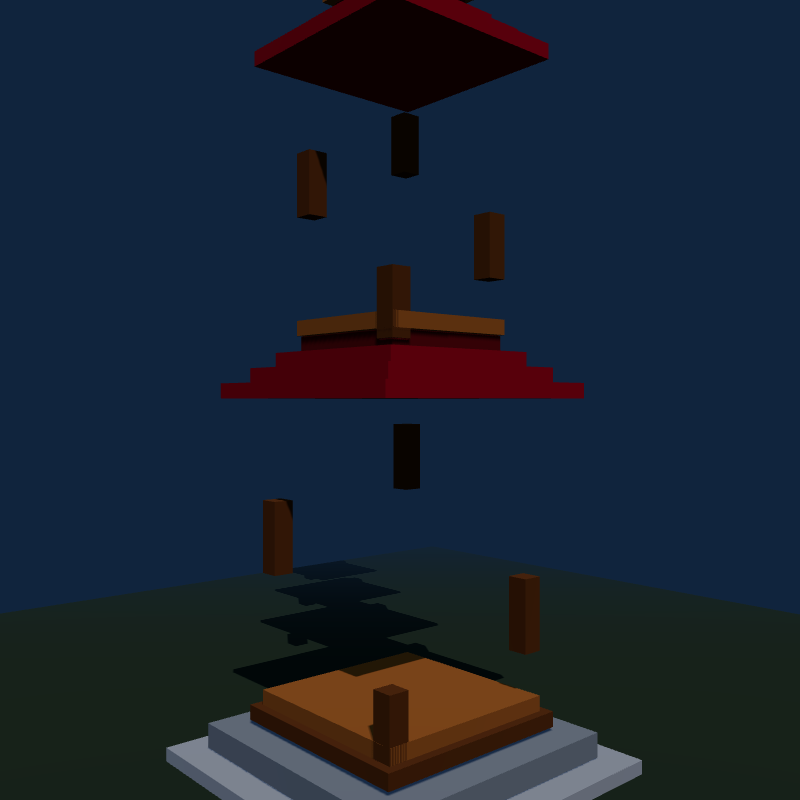

# q8_0 at the full 262,144-token window on a 12 GB card

Measured 2026-09-26/27 on an RTX 4070 12 GB (PCIe 4.0 x16, Windows WDDM, GDDR6X +1500 MHz as in every number
since #221), i7-13700K with 32 GB, Bonsai 2 27B `PTQ1_0` with the ProCreations MTP head, served by
`start-server.ps1`, one slot, genuine prefill (no slot restore) unless noted. Runtime: branch
[`bonsai-q8-product`](https://github.com/professorpalmer/llama.cpp-ada-ternary/tree/bonsai-q8-product) (patches
0028-0033 on top of #221), upstream as [PrismML #285](https://github.com/PrismML-Eng/llama.cpp/pull/285).

## Result

| Depth | Prefill (tok/s, cumulative) | Decode (tok/s, greedy code, 256 tokens) | Before (README, Sep 2026) |
| ---: | ---: | ---: | --- |
| 4k | 1,100 | 83 | ~80 |
| 16k | 1,100 | 106 (prose 87) | ~75 |
| 32k | 918 | 100 | 47.6 |
| 64k | 724 | 87 (prose 72) | 36.9 |
| 112k (last VRAM position) | 539 | 70 | past the 96k window |
| 131k | 374 | 41 | q8_0 did not fit |
| 180k | 298 | 27 | q8_0 did not fit |
| 258k | 229 | 14.7 | q8_0 did not fit |

KV precision (docs/QUALITY.md, wikitext-2 KL against f16 K/V at 8-16k depth): q8_0 mean KLD 0.00017, top-1
agreement 99.38%; q4_0 0.00218, 97.93%. The previous 12 GB routes to 262k all used q4_0.

## What does it

1. **Tiered KV cache** (`--kv-vram-cells N`). Each attention layer's K/V buffer is one CUDA VMM range: pages for
   cells `[0, N)` backed by VRAM, the rest by pinned host memory (`cuMemCreate` with a host location), mapped into
   the same device range. Kernels are unchanged and touch host pages only once a sequence is that deep. On this
   card: VRAM head 520-530 GB/s, host tail 23 GB/s, contiguous across the seam. `start-server.ps1` sizes N at launch
   from free VRAM (see *The VRAM line*).
2. **Host-tail staging** (on by default; `GGML_CUDA_KV_TIER_STAGING=0` off). A second VMM alias maps the same VRAM
   head plus a shared VRAM staging buffer in place of each host run. An attention op whose K/V range reaches the
   tail copies the used host rows into staging with the copy engine and reads the alias. Prefill: the tail is read
   once per op instead of once per query tile (146 -> 280 tok/s at 180k). Decode: DMA instead of SMs reading host
   memory (+28% at 180k).
3. **Quantized-KV GQA decode on the MMA attention kernel** (default for <= 8 queries; `GGML_CUDA_FA_MMA_DECODE_MIN_KV`).
   Bonsai 2 has 24 query heads over 4 KV heads; the vector kernel reads each K/V row once per query head, the
   in-place MMA kernel from #221 once per KV head. 4k 78.1 -> 86.9, 16k 77.7 -> 111.6 tok/s.
4. **MTP drafting at every depth** (`--spec-draft-window 16384`). The old `--spec-draft-depth-max 24576` stopped
   drafting because a deep verify batch cost more than it saved. With (3) a verify reads K/V once, and the draft
   context keeps only its last 16k rows (sized for them, cells reused), so a draft pass costs the same at any depth
   and the draft cache (~100 MB) stays in VRAM. 32k 54.5 -> 103.6, 64k 48.0 -> 90.1 tok/s; draft acceptance
   unchanged (the MTP head predicts from recent context).
5. **Draft size past the VRAM line** (`--spec-draft-n-max-tail 4`): a PCIe-bound step makes each extra verify
   column nearly free. +26% code / +15% prose at 180k for 4 vs 2. Below the line 2 stays best (prose at 16k: 87 vs
   82.5 for 3; code +3% for 3).
6. **Harness-proofing** (`--reasoning-effort-allow medium`, `--reasoning-max-tokens-floor 24576`). Effort words the
   template does not accept ("high" -> HTTP 500 in Cline, Kilo, Open WebUI) become medium, and so do `low` and
   `xhigh` (medium beats both at every output cap in Killy's grid; PrismML's card says low behaves close to xhigh).
   With thinking on, a client cap below the think budget + 4096 is raised to it. Smoke test: `reasoning_effort:
   "high"`, `max_tokens: 256` returns the answer. Replays of Killy's rows: *Killy's plates, replayed* below.

## The VRAM line

Windows (WDDM) demotes a background process's allocations to shared memory once the card is near full, silently:
decode drops by a third or more and nothing errors. The line is the most positions that stay clear of that, and it
depends on what the desktop holds.

| Setup | Desktop VRAM on the 4070 | Margin that held a 10-minute soak | Auto line | Decode 4k / 16k |
| --- | ---: | ---: | ---: | --- |
| display on the 4070 | ~930 MiB (dwm 648) | 1300 MiB (800 held for minutes, then 79.9 -> 56.8 tok/s) | 95,488 | 84.8 / 108.5 |
| display on the iGPU, apps on the iGPU | ~285 MiB (dwm 219) | 1000 MiB (600 paged at once: 78 / 90) | **112,896** | 83.7 / 107.0 -> 82.9 / 106.8 |

`start-server.ps1` picks the margin from `nvidia-smi` (`display_active`). **Correction to our own estimate:** before
the swap we expected ~1 GB back and ~30k more positions. Measured: ~650 MiB less desktop VRAM and +17.4k positions,
because Windows keeps ~220-275 MiB of compositor surfaces on the discrete card in a hybrid setup and the demotion
point sits near ~11.6 GB in use either way. The gain is still real where it lands: decode at 112k moved from past
the line (PCIe-bound) to 70 tok/s in VRAM, and 131k from 34.3 to 41.2.

## Identity (greedy, 256-token code and prose continuations, fresh prefill each)

| Comparison | 4k | 20k | 40k |
| --- | :---: | :---: | :---: |
| tiered KV vs all-VRAM, draft off | = | = | = |
| tiered KV vs all-VRAM, draft on, same flags (product build, CLI flags) | = | = | = |
| draft on vs off, vector attention below 32k (pre-product gate) | = | = | differs |
| draft on vs off, MMA decode route at every depth (default) | differs | = | differs |

The tiered cache is exact. Drafting is not bit-identical to not drafting, stock kernels included: attention's KV
split follows the kernel instance (1-query decode and a 3-5 query verify use different MMA tiles) and the padded KV
length (a verify batch can push it one 256-tile ahead of a later single decode). The differences are rounding-level;
every continuation is a valid greedy decode of the model. `GGML_CUDA_BATCH_INVARIANT=1` does keep the PTQ1_0 weight
path exact across batch widths (patch 0030 extends it to 5-8 column verifies, which used to go to MMQ).

## Killy's plates, replayed

Killy's HumanEval plates (164 problems, tests executed, the model's own sampling, one seed per row) replayed against
this server with `bench\killy_suite.ps1`, 2026-09-27: `Ternary-Bonsai-2-27B-PTQ1_0` + MTP head, 262,144 window, q8_0
KV (tiered), `start-server.ps1` defaults. His plates ran `Ternary-Bonsai-2-27B-PQ2_0` (2-bit weights) on PrismML's
build with a 64k window, so the weights differ; his numbers are the reference for the *client setup*, not a
same-weights comparison.

| Client setup (Killy's row) | Killy (PQ2_0) | This server, harness-proofing **off** | This server (default) |
| --- | ---: | ---: | ---: |
| `reasoning_effort: "high"` (Cline, Kilo, Open WebUI) | 0 (HTTP 500) | **0 of 20** (HTTP 500, 0.1 s) | **160** / 164 (and a 256-token cap) |
| 256-token cap (PrismML quickstart) | 17 | (same request as above) | **160** / 164 |
| 4096-token cap, no effort word (Continue) | 137 | **148** / 164 | **157** / 164 |
| `medium`, 8k+ cap (his best cell) | 160-161 | | **161** / 164 |
| thinking off | 137-148 (by cap) | | **138** / 164 |

- **Harness-proofing is the difference between 0 and 160** for the apps that send `"high"`: the same server with
  `BONSAI_HARNESS_PROOF=0` fails every request with HTTP 500 (the template raises on the word), exactly Killy's
  0. With it on, "high" becomes medium and the 256-token cap becomes the thinking budget + 4096.
- **The output-cap floor alone is worth 9 problems** at a 4096-token app cap (148 -> 157 on the same server; the server's
  medium default already applies in both, so this isolates the cap; Killy's 137 also carried xhigh).
- **Medium thinking inside the full 262k q8_0 window matches his best cell** (161 of 164 on his plate, 161 here) on
  the ternary PTQ1_0 file. Two of the three misses ran into the 20,480-token thinking budget and were force-closed.
- **Thinking off is 23 problems behind medium** (138 vs 161): on this model the reasoning is worth more than any
  runtime change. Keep medium for code; the thinking-off recommendation is for tool-call payloads (docs/QUALITY.md).
- Noise: one seed per row; Killy measured 1-3 problems of movement between seeds at a 16k cap.

The voxel pagoda (plate 037P's prompt, one sample each, rendered headless after 6 s):

| medium | thinking off |
| --- | --- |
|  |  |
| a five-tier scene: stone base, platform, pillars, stacked red roofs (the tiers float apart) | the scene background only: "drew nothing" in the plate's terms |

## Measured and not adopted

| Idea | Result |
| --- | --- |
| K mean-centering (`--kv-mean-center`, also tried on q8_0) on top of the default Hadamard KV rotation | q4_0 KLD 0.00206 vs 0.00218 but max KLD 2.87 vs 0.94; q8_0 unchanged. Rotation already absorbs the offset. |
| Model-card non-thinking sampling (0.7 / 0.8, no presence penalty) for tool calls | `bench\toolcall_stress.py`, n=9: parsed 6/9 vs 8/9 at 1.0 / 0.95; more payloads ran into the cap. |
| Thinking `medium` for payload-heavy tool calls | 6/9 parsed vs 8/9 thinking-off; 10-17k thinking tokens first. Medium stays the chat/coding default. |
| `GGML_CUDA_GRAPH_OPT=1` (concurrent streams) | tg128 66.1 vs 67.9. |
| PTQ1_0 mat-vec at 5-6 columns instead of MMQ (outside BATCH_INVARIANT) | pp5 161.7 vs 172.4; the 4-column crossover stands. |
| Draft cache fully in VRAM, paid for with a lower KV line | 16.0 vs 17.2 tok/s at 180k; the draft window is the better fix. |
| One MMA tile shape for all <= 8-query batches (batch invariance) | -7% at 64k and still not invariant (KV length). |
| Shallow draft size 3 | code +3%, prose -6% at 16k. |
| VRAM margin 600 MiB with the display on the iGPU | paged immediately (78 / 90 vs 84 / 107 tok/s). |

## Caveats

- Past the VRAM line the numbers are PCIe-bound (4.0 x16 here). PCIe 3.0 or x8 halves them.
- The VRAM line assumes the desktop does not grow much after launch. A game or a GPU video on the same card while
  the server runs will make Windows demote it: slower, not broken. Restart the server after.
- `/slots?action=restore` does not rebuild the draft context; deep measurements from a restored slot understate
  draft cost and acceptance.
- Pinned host memory for the tail: (262,144 - N) x 34,816 bytes, ~5.2 GB at N = 113k. Keep ~8 GB of RAM free.

## Reproduce

```powershell
.\start-server.ps1                                  # the recipe
$env:BONSAI_TIER='0'; .\start-server.ps1            # previous 96k all-VRAM recipe
bench\killy_suite.ps1                               # HumanEval replays + pagoda
bench\kv_mean_center_kl.ps1                         # mean-centering KL (needs the kv_kl_sweep base file)
python bench\toolcall_stress.py --temp -1 --top-p -1
```
